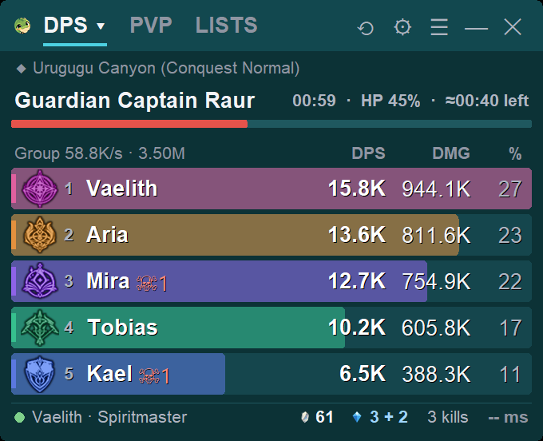
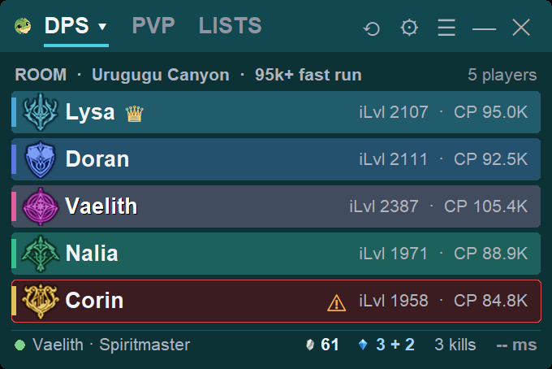
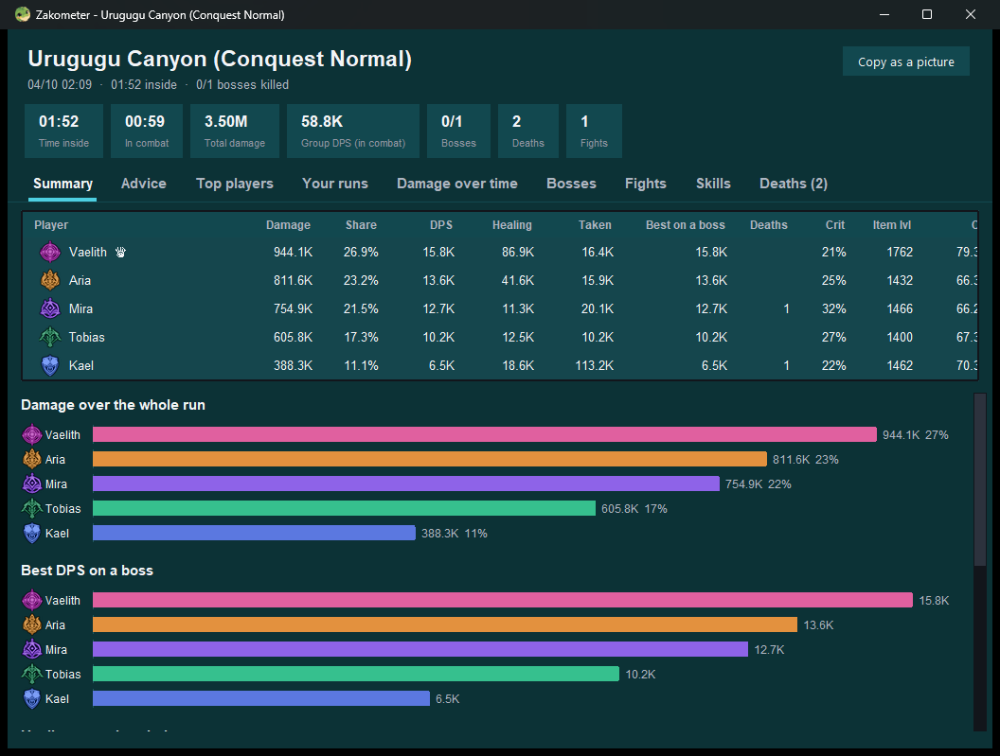
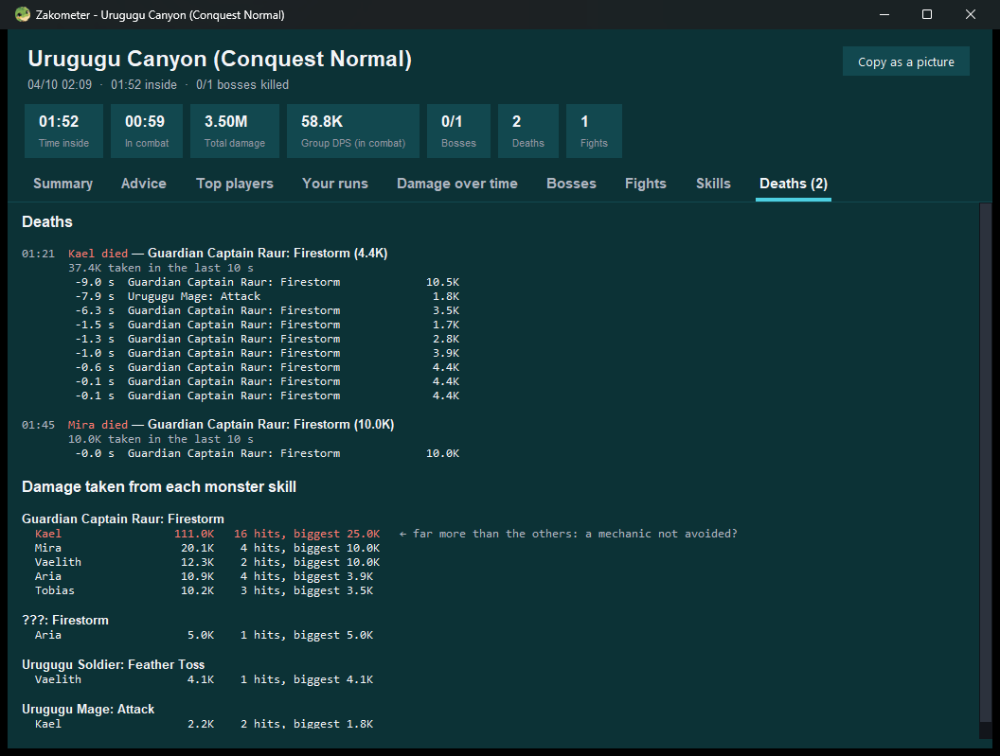
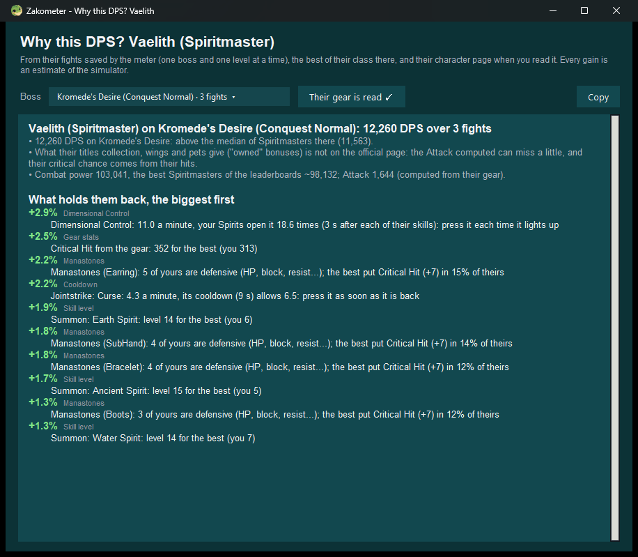
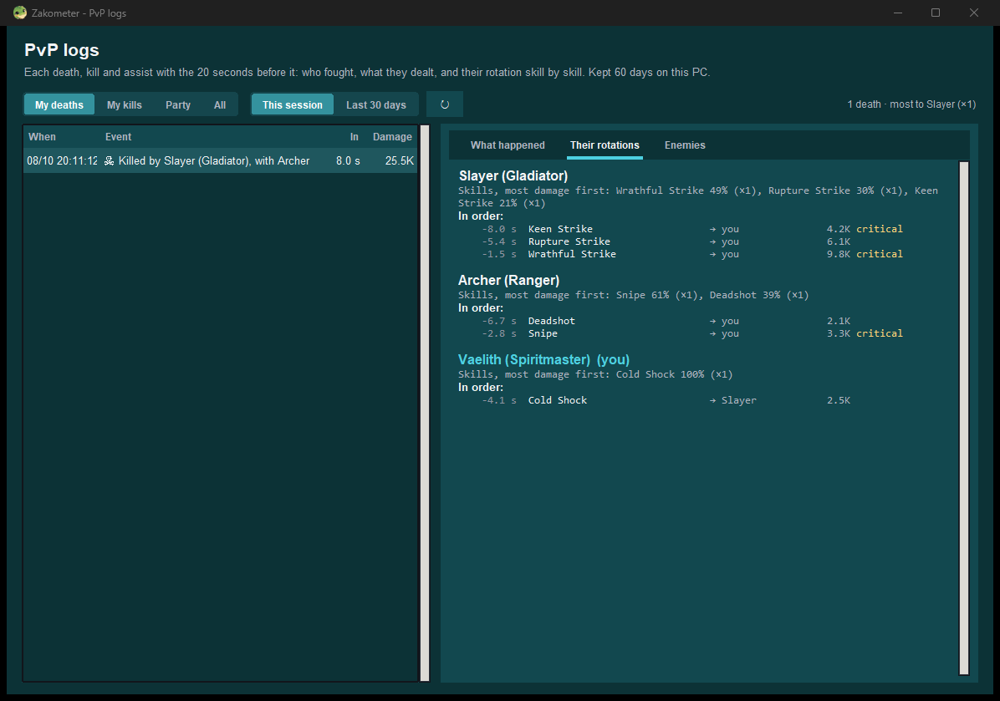
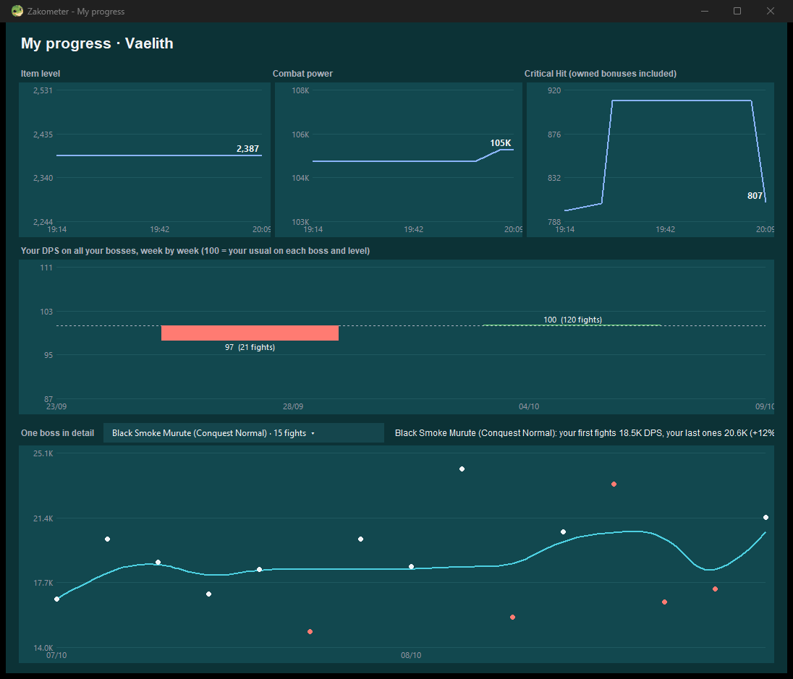

# Zakometer: a local DPS meter for Aion 2

> **⚠ Use at your own risk.** Zakometer is a third-party tool. It only *reads* the game's
> network traffic on your PC (like every DPS meter): it never touches the game, never
> injects anything, never automates anything. NCSoft has not banned personal meters; their
> warning (May 2026) was about tools that collect and publish other players' data without
> their consent. Zakometer keeps everything on your PC and publishes nothing. Still, no
> third-party tool is risk-free, and NCSoft can change its rules at any time.
> Not affiliated with NCSoft.

**[⬇ Download the latest Zakometer.exe](https://github.com/zakariagharbi22091996-png/zakometer-releases/releases/latest)**

## What it does

- **Live overlay**: you and your party, damage / healing / damage taken, boss HP and time
  left, your resurrection stones, where you are (dungeon and mode, Transcendence, Nightmare
  level, Abyss, arena). In the open world, random players are hidden, except on a field boss
  or an event.
- **Room check**: join a room and see who is in it before the run: class, item level,
  combat power, who leads. Anyone on your blacklist shows up in red.
- **Dungeon summary** when you leave: everyone's damage over the whole run, bosses, fights,
  skills, advice, and a **Deaths** tab: what killed each player in their last 10 s, and the
  damage everyone took from each boss skill (who keeps eating the mechanics). Nothing pops
  up during the run.
- **Why this DPS?**: right-click any player, or yourself: what holds them back, biggest first,
  each fix priced in % of DPS (rotation, skill levels, manastones, gear). Works for every class.
- **PvP logs**: each death / kill / assist with the 20 s before it, and the enemies' rotation
  skill by skill.
- **My progress**: item level, combat power, critical hit, your DPS week by week, one boss
  in detail.
- Optional: a soft sound when a skill is ready (you pick the skills, the sound and the
  volume), buff and debuff uptime, blacklist / whitelist with your own notes, copy the
  overlay as a picture for Discord.

Comparisons are always like for like: same boss, same difficulty, same level (Nightmare 10
is never set against Nightmare 1, Conquest never against Exploration).

| | |
|---|---|
|  |  |
|  |  |
|  |  |

*Player names in the screenshots are changed.*

## Install

1. Download `Zakometer.exe` and run it. If Windows says "Windows protected your PC":
   *More info* → *Run anyway* (the file is not code-signed).
2. The first time, Zakometer offers to install **Npcap** (free, needed to read the network
   traffic): *Install Npcap* → Yes → *I Agree* → *Install*.
3. Play Aion 2 in windowed or borderless mode. Your character is recognised the next time
   you change zone or teleport.

## Privacy

Everything stays on your PC (fights, summaries, logs). Zakometer goes online only:
- at start (and every 6 h) to check this page for a newer version (nothing about you is sent;
  you can turn it off in the settings);
- when **you** search a character or read a sheet (NCSoft's official site).

## Updates

When a newer version is out, the overlay says so: menu ☰ → **Update** downloads it, closes
Zakometer, replaces the file and starts it again.
